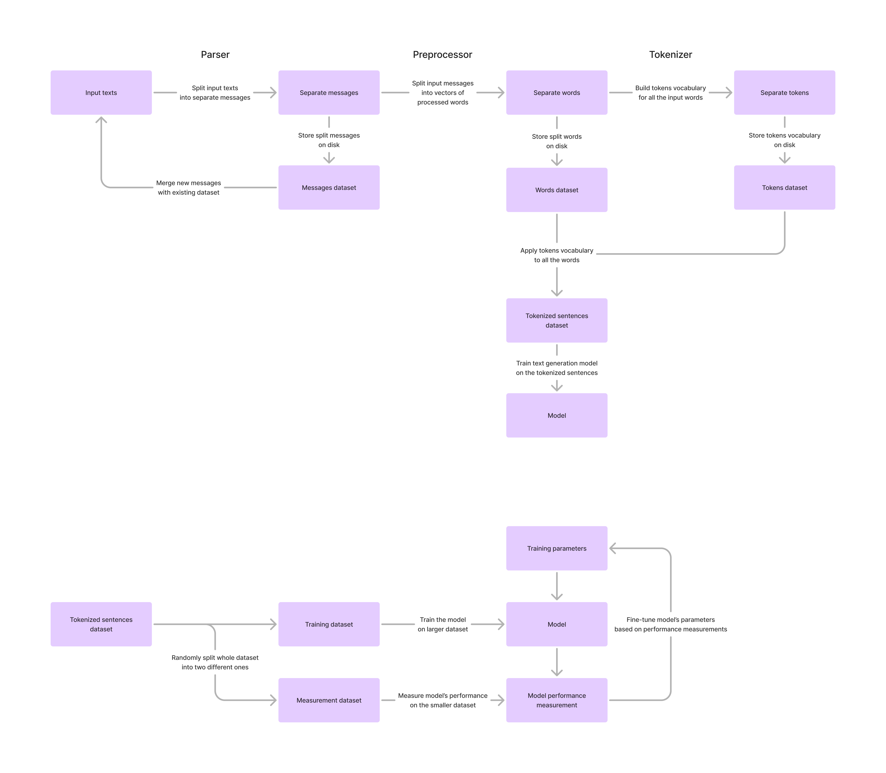

# Purely statistical text generator

Started as a joke project, this crate contains set of different natural language
processing and generation algorithms optimized to work with large datasets
by storing all the data on disk and performing computations on small chunks
of the data.

Instead of making data-driven models based on neural networks which can
learn linguistic features from large amounts of input data here we construct
purely statistical, mathematical models of the language from smaller amount
of input data and use these models to generate new text.

Model-driven generators require much less time for training, can be run
by virtually everybody and are more than enough for making fun!

Sources of inspiration:

- https://en.wikipedia.org/wiki/Markov_model
- https://en.wikipedia.org/wiki/Hidden_Markov_model
- https://en.wikipedia.org/wiki/Baum–Welch_algorithm
- https://en.wikipedia.org/wiki/Viterbi_algorithm
- https://en.wikipedia.org/wiki/Forward–backward_algorithm

## Workflow

The whole model building process is split into several stages. Each stage
can be executed individually to fine-tune your parameters with different
algorithms and options, and to save materials for future work.

Stages' results are stored in storages on disk which compress all the data
to save your disk space.

## Commands

List of all supported commands.

### Parsing

Parsers extract meaningful pieces of data from the text corpuses.
While some are straightforward, others may implement advanced logic.

| Command                       | Description                                                                             |
| ----------------------------- | --------------------------------------------------------------------------------------- |
| `parser newline parse`        | Split input text files by new lines separators, assume each line is individual message. |
| `parser newline dump`         | Print messages as JSON strings to the stdout.                                           |
| `parser discord-export parse` | Parse messages from the exported discord history and optionally format them.            |
| `parser discord-export dump`  | Print messages as JSON strings to the stdout.                                           |
| `parser storage info`         | Print stats of the parsed messages storage.                                             |
| `parser storage merge`        | Merge given parsed messages storages into single one.                                   |
| `parser storage dump`         | Print parsed messages as JSON strings to the stdout.                                    |

### Preprocessing

Preprocessors split messages into words and format them, optionally making
all the text lowercased, removing all the punctuation and so on. Choosing
pre-processor and its parameters directly affects final model's quality.

| Command                                    | Description                                                    |
| ------------------------------------------ | -------------------------------------------------------------- |
| `preprocessor whitespace preprocess`       | Split words by whitespace characters (spaces, new lines, etc). |
| `preprocessor whitespace dump`             | Print words as JSON arrays to the stdout.                      |
| `preprocessor natural-language preprocess` | Split words into natural language components.                  |
| `preprocessor natural-language dump`       | Print words as JSON arrays to the stdout.                      |
| `preprocessor storage info`                | Print stats of the preprocessed messages storage.              |
| `preprocessor storage merge`               | Merge given preprocessed messages storages into single one.    |
| `preprocessor storage dump`                | Print preprocessed messages as JSON strings to the stdout.     |

### Tokenizing

TODO

Author: [Nikita Podvirnyi](https://github.com/krypt0nn)\
Licensed under [GPL-3.0](LICENSE)
